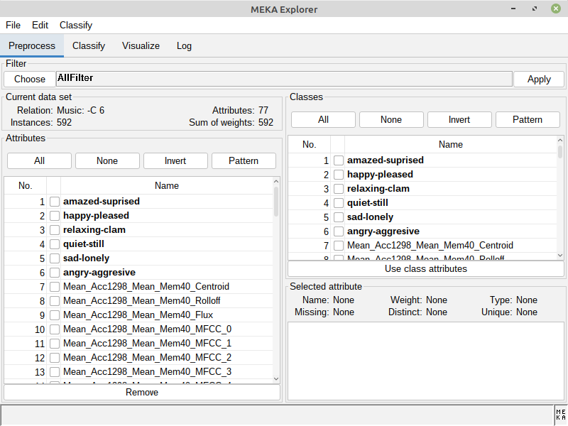
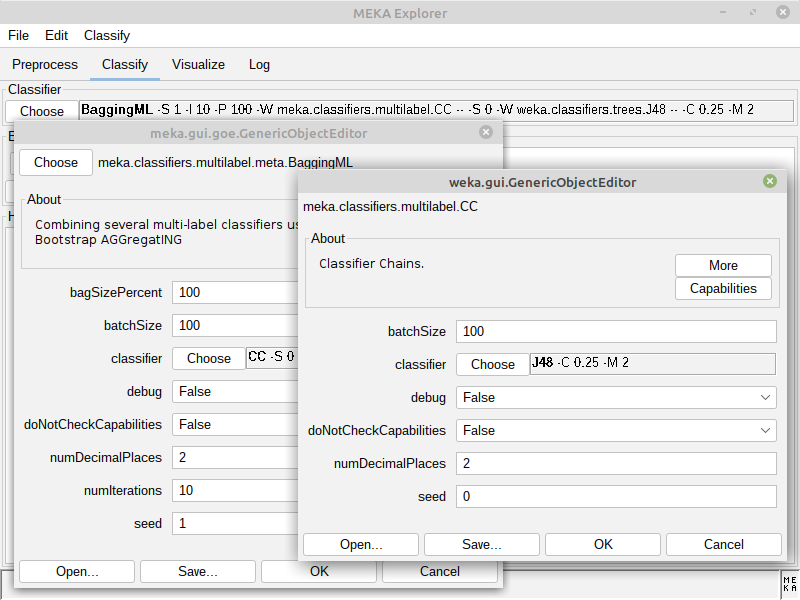
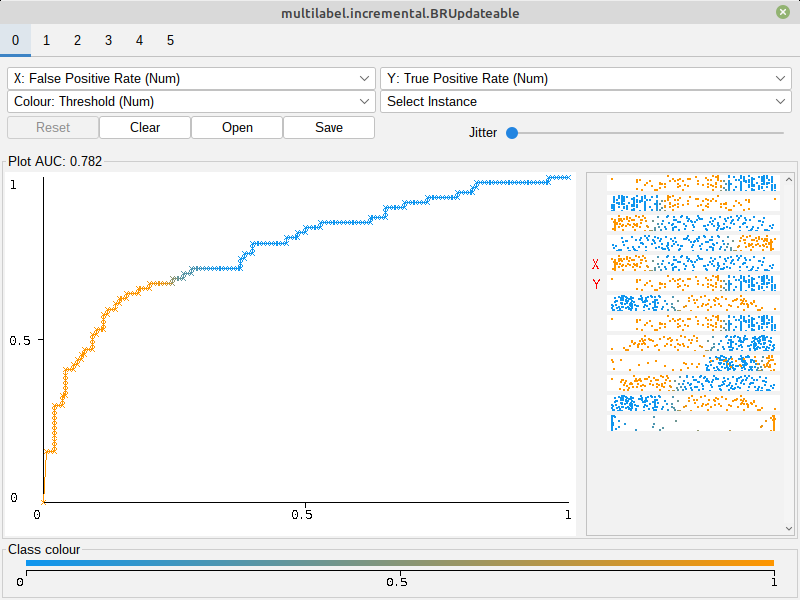

The **MEKA project** provides an open source implementation of methods for **multi-label** 
learning and evaluation. In [multi-label classification](http://users.ics.aalto.fi/jesse/talks/Multilabel-Part01.pdf), 
we want to predict multiple output variables for each input instance. This different from the 
'standard' case (binary, or multi-class classification) which involves only a 
single target variable. MEKA is based on the [WEKA](http://www.cs.waikato.ac.nz/ml/weka/) 
Machine Learning Toolkit; it includes dozens of multi-label methods from the scientific literature, 
as well as a wrapper to the related [MULAN](http://mulan.sourceforge.net/) framework.

An introduction to multi-label classification and MEKA is given in a [JMLR MLOSS-track paper](http://jmlr.org/papers/volume17/12-164/12-164.pdf).

The main developers of MEKA:

* [Jesse Read](http://jmread.github.io/) (Ecole Polytechnique, France)
* [Peter Reutemann](http://www.cms.waikato.ac.nz/~fracpete/) (University of Waikato, New Zealand)
* [Joerg Wicker](https://unidirectory.auckland.ac.nz/people/profile/j-wicker) (University of Auckland, New Zealand)

